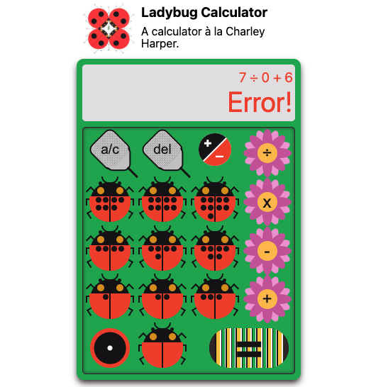
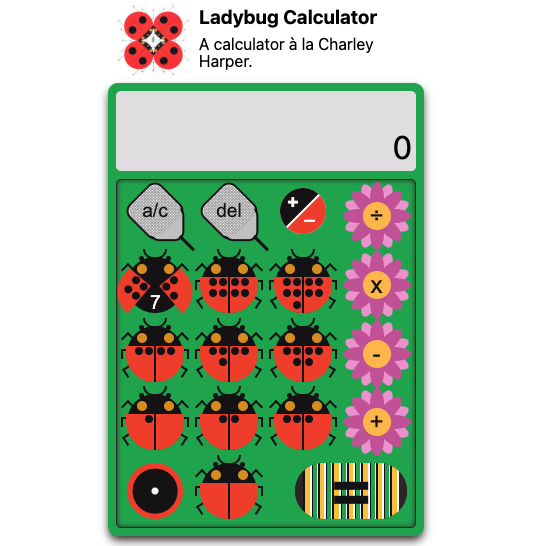

# Ladybug Calculator

## What
A calculator app with React and Typescript, but made saucy by having the buttons be bugs or petals or other garden objects. The look is inspired by Charley Harper. 

More than a basic left-to-right calculator, this app considers order of operations, various edge cases such as operation swapping if x to ÷ but if x then - the subtraction sign acts to negate (once, no toggling). As much as possible, this follows the behaviour of a smartphone. 

On hover and click, the buttons have unique behaviour:
 - bugs (numbers) have the number of dots to match their value and wings spread to show the arabic numeral: bug 4 has 4 dogs and wings spread to show "4"
 - flowers (operators) have petals that change to a darker color to show the sign. 
 - caterpillar (equal) has stripes that change on hover
 - swatters (del and a/c) show guts
 - black/red circle (toggle pos neg) switch colors
 - dot (decima) shrink. This is the only button I might change once I get an idea of a bug/garden look that is ... "dottish"

 Notes:
 - Implicit multiplication. e.g. when user clicks 5 toggle 6 it'll becomes (-5)6 on display, but expression will be -5 x 6.

## How

- React
- TypeScript
- CSS
- Vite

## What about ...
aka "Intentional limitations"
- Toggling with no current number defaults to 0 (so 4 x toggle -> 4(0))
- Toggle toggle will keep parentheses as it does not affect evaluation: 8 toggle (-8) toggle (8) x 6 evals to 48. 
- Display removes parentheses in history after evaluation (If I do a larger calc, I'll attempt to change this)
- Basic operators only (no %, √, parentheses for grouping -- leave for another larger calc)